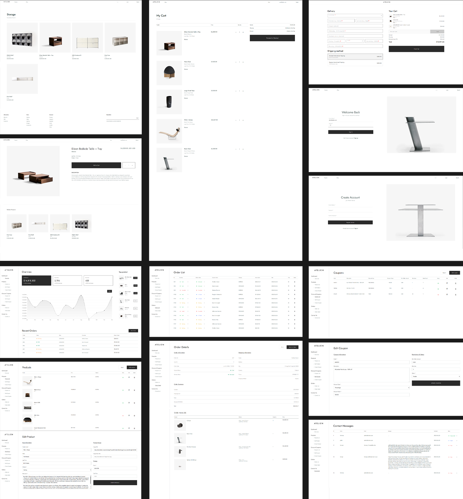

# store.atelien

## Demo



## Tech Stack

### Frontend
- HTML5
- CSS3
- JavaScript (Vanilla)

### Backend
- Node.js
- Express.js
- MySQL2
- bcryptjs
- jsonwebtoken
- cookie-parser
- xlsx
- nodemon

### Database
- MySQL

---

## Installation & Usage

### 1. Clone the Repository

#### macOS/Linux
```bash
sudo git clone https://github.com/xircons/store.atelien.git
```
#### Windows
```bash 
git clone https://github.com/xircons/store.atelien.git
```

### 2.  Setup Backend
```bash 
cd server && npm start
```

---

## Image Credits

All product images used in this project are from [https://store.leibal.com](https://store.leibal.com).  
They are used **strictly for academic and non-commercial purposes only**.  
**All image rights belong to Leibal and the original creators.**

## ! Disclaimer

> This project is a student work made for educational demonstration only.  
> It does not represent a real business, and no part of it should be interpreted as such.  
> Product images and branding are used under fair use for learning and presentation.  
> **Do not redistribute, republish, or commercialize this project.**

## 📂 License

This project is **not open source**. Please refer to the [`LICENSE.txt`](LICENSE.txt) file for usage terms.
